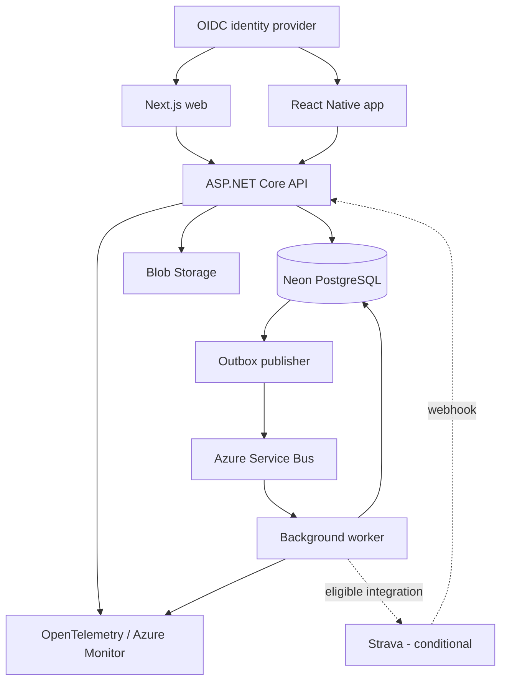

# Bicycle maintenance tracker — draft project plan

Draft date: 2026-10-01. Working name: BikeCare (name not yet selected).

Overall design: see [the 2026-10-01 specification](docs/superpowers/specs/2026-10-01-bike-maintenance-design.md), approved by the owner on 2026-10-01. This roadmap follows those decisions.

Confirmed scope: the owner requires a React Native mobile app alongside the Next.js web app. Backend implementation comes first and detailed UI design follows later; the mobile app remains a required delivery milestone.

## 1. Purpose

Build a bicycle maintenance app that is useful for personal riding and demonstrates Microsoft Azure, React/Next.js, mobile development, and cloud-native/distributed systems design.

The app answers:

- Which components are fitted to each bike?
- How many kilometres or riding hours has each component accumulated?
- When was it last maintained, and what work was done?
- Which inspections or maintenance tasks are due?
- What happens to component mileage when individual parts move between bikes? Wheelset assemblies follow later.

Initial audience: the project owner, using real bikes and maintenance records. Later: a small private pilot. Public release is a separate milestone.

## 2. Example workflow

1. Create a gravel bike and add its chain, cassette, and front/rear tyres.
2. Record each component's installation date and any known starting usage.
3. Log a 65 km ride against the bike.
4. The app allocates the ride to the components fitted at the ride's start time.
5. Record a chain inspection or lubrication without resetting the chain's lifetime usage.
6. Replace the chain: close its installation period, retain its history, and install a new component.
7. Move an individual component between bikes: future rides accumulate usage against its new dated installation.
8. Review distance, maintenance history, costs, and due inspections on web or mobile.

Reminders prompt inspection or service based on user-defined thresholds. They do not claim to measure actual component wear or guarantee that a bike is safe.

## 3. Proposed technology choices

These are draft recommendations, not implementation commitments.

| Requirement | Proposed technology | Role and learning outcome |
|---|---|---|
| React / Next.js | Next.js with React and TypeScript | Web dashboard, bike configuration, component history, reminders and cost views |
| React Native mobile app (required) | React Native with Expo and TypeScript | Android/iOS maintenance logging, camera uploads and later offline operation |
| .NET backend | ASP.NET Core with EF Core | Shared API, domain rules, authorization and background processing |
| Microsoft Azure | Azure Container Apps | Deploy web, API and worker as containers; practice revisions, health checks and scaling |
| Relational persistence | PostgreSQL in Docker locally; a dedicated Neon Free project for cloud deployment | Installation history, transactions, constraints and migrations |
| Messaging | Azure Service Bus | Durable work queues, retries, dead-letter handling and idempotent consumers |
| File storage | Azure Blob Storage | Optional component photos and receipts |
| Identity | Standards-based OIDC provider; Microsoft Entra External ID as an Azure candidate | Shared user identity for web/mobile; validate consumer sign-in and mobile support in an early spike |
| Secrets and service identity | Azure Key Vault and managed identities | Keep credentials out of source and use identity-based Azure resource access |
| Observability | OpenTelemetry and Application Insights / Azure Monitor | Correlate API requests with background work; inspect logs, traces and metrics |
| Infrastructure and delivery | Bicep, Docker and GitHub Actions | Repeatable provisioning, tests, deployments and workload identity federation |

React Native is the confirmed mobile choice because it reinforces React and TypeScript across both clients. Share API types, validation where appropriate, and design conventions; native and web screen implementations remain separate. A responsive web app supports phone browsers, while the required React Native app delivers the native mobile learning objective.

The original React Native / .NET MAUI requirement is satisfied by React Native. ASP.NET Core provides C#/.NET experience in the backend; a second mobile framework is deferred.

Expo is a React Native framework for Android/iOS development. Container Apps supports containerized and event-driven applications, and managed identities support access to compatible Azure services. Sources: [Expo](https://docs.expo.dev/get-started/create-a-project/), [Azure architecture](https://learn.microsoft.com/en-us/azure/architecture/example-scenario/serverless/microservices-with-container-apps-dapr), [managed identities](https://learn.microsoft.com/en-us/azure/container-apps/managed-identity).

Select supported framework versions when implementation begins and pin them. Exact cloud SKUs, identity setup and costs remain to be verified.

## 4. Scope

### First useful release

- Personal account with strict ownership checks.
- Multiple bikes and individually tracked components.
- Install, remove, replace and move components with dated history.
- Manual rides with distance, start time and optionally riding duration.
- Known starting mileage for previously used components, with an explicit estimate label.
- Component lifetime usage and usage during its current installation.
- Maintenance records: task, date, notes, optional cost, and component or bike association.
- Distance/time-based reminders and a list of upcoming tasks.
- Next.js dashboard plus a React Native client for quick ride and maintenance entry.
- Visible recalculation/synchronization status.

### Later increments

- Wheelset assemblies that include wheels and their fitted tyres.
- Explicit indoor equipment configurations for trainer setups using different parts.
- Offline mobile entry and explicit conflict resolution.
- Photos and receipts.
- Optional push notifications.
- Eligible activity imports, including a conditional Strava integration.
- Data export, account deletion and a small private pilot.

### Deferred

Marketplace, mechanic booking, payments, social feeds, training analytics, AI recommendations, Kubernetes, multi-region deployment, and a second mobile framework. These can be reconsidered if they serve an actual use case.

## 5. Strava feasibility — resolve before persistent integration

The API is technically suitable for fetching activity distance, time, date and the assigned bike identifier (`gear_id`). Users authorize access through OAuth. Activities marked Only Me need `activity:read_all`. Strava's documented gear API does not supply the component installation history required by this app. [API reference](https://developers.strava.com/docs/reference/), [authentication](https://developers.strava.com/docs/authentication/).

However, current policy creates a material uncertainty for long-term component tracking: seven-day caching, restrictions on persistent storage including derived data, and restrictions on analytics/combining data. Persistent component totals must not be assumed permitted simply because raw rides are discarded. Clarify the intended maintenance calculations and retention model with Strava before implementing that path. This is a feasibility dependency, not a claim that Strava has rejected this app. [API policy, sections 5.4–5.5 and 6.2](https://www.strava.com/legal/api_policy).

New API apps start with the developer's account. Current documentation requires a developer subscription, allows a dashboard upgrade to ten athletes, and requires review for expansion beyond that. [Getting started](https://developers.strava.com/docs/getting-started/).

Integration spike:

1. Verify account eligibility and application settings.
2. Clarify permitted calculation, storage, reconciliation and deletion behavior for this use case; record the outcome.
3. Exercise OAuth, minimal activity reads and bike matching in a disposable development environment with a transient cache.
4. Prove webhook delivery, rate-limit handling and disconnect behavior.
5. Decide whether to proceed, narrow the feature, or defer Strava while continuing the core app.

If the retention/calculation model is supported, the proposed flow is webhook → API → durable work queue → Strava connector/worker → usage recalculation. Keep Strava credentials and API calls within the connector boundary and verify the deployment against provider credential-handling rules.

Webhooks cover creation/deletion and selected activity changes; bike assignment changes are not among the documented update fields. A reconciliation strategy or explicit resync is required. OAuth refresh, duplicate events, revoked access, deletions and rate limits must be covered. [Webhooks](https://developers.strava.com/docs/webhooks/).

For core development, use independently entered ride records and synthetic integration fixtures. Other import sources need their own permission/retention review; copying Strava API data into a manual record is not a proposed workaround.

## 6. Architecture

Start with a modular API and synchronous usage calculation. Add one independently deployed worker during the later Azure/asynchronous milestone. The diagram below shows that later architecture. Keep domain rules in the backend so both clients produce the same results.



The later outbox publisher uses scheduled, bounded polling to avoid keeping Neon compute active through continuous database polling. Service Bus drives recalculation work. Choose the polling interval and runtime arrangement during that milestone. Database arrows show dependencies, not a database-trigger implementation.

Proposed modules: bikes/components, installation history, rides/usage, maintenance/reminders, and external integrations. One PostgreSQL database is sufficient initially; enforce module ownership in code. Extract another service only when there is an independently useful scaling, reliability or ownership boundary.

Distributed-system behaviors to implement:

- **Transactional outbox:** persist a ride change and pending event together, preventing database/queue dual-write loss.
- **At-least-once processing:** consumers use unique event identifiers and transactional deduplication; retries do not double mileage.
- **Eventual consistency:** the API saves edits promptly; UI shows pending/recalculated usage and last successful processing time.
- **Deterministic rebuilds:** manual ride and installation history can reproduce usage after corrections or a lost projection.
- **Optimistic concurrency:** stale edits are rejected with an actionable conflict response.
- **Failure recovery:** bounded retries, dead-letter inspection and controlled replay.
- **Observability:** correlation identifiers connect client request, outbox event and worker execution without logging credentials or sensitive payloads.

## 7. Initial data model and rules

| Entity | Essential information |
|---|---|
| User | Internal ID and external identity subject |
| Bike | Owner, name, category and optional user-entered starting distance |
| Component | Owner, type, model, initial usage estimate and status |
| Installation | Component, bike, position, start/end timestamps |
| Ride | Owner, bike, start timestamp, distance, optional duration and source/provenance |
| MaintenanceRecord | Bike/component, task, performed timestamp, notes and optional cost/currency |
| ReminderRule | Component/task, distance or time interval, reset baseline and enabled status |
| UsageProjection | Calculated totals, calculation version and processing status |
| Outbox / ProcessedEvent | Reliable publication and consumer deduplication state |

External connection/cache records are conditional on the Strava feasibility outcome; do not design an indefinite provider activity archive by default.

Domain rules:

- Store distances in metres, durations in seconds and timestamps in UTC; display local dates/times.
- Use installation intervals `[start, end)` and assign a whole ride using its start timestamp in the first release. Document this simplification.
- A component cannot be installed in two places simultaneously. Mutually exclusive positions cannot overlap on a bike.
- Historical corrections affect the relevant rides and trigger recalculation. Missing installation history creates an allocation gap, not guessed usage.
- Replacing a component creates a new identity; servicing it does not erase lifetime usage.
- Track lifetime usage separately from usage since the relevant maintenance task.
- A cassette can remain fitted during indoor trainer use while the bike's wheels do not accumulate usage. Explicit indoor equipment configuration is a later increment; the first release does not claim correct allocation for trainer setups using different parts.
- Manual/imported ride duplicates require a visible resolution rule. Provider IDs alone do not detect a manually entered copy of the same ride.
- Keep user-entered records and provider-derived data distinguishable for correction, deletion and retention.

## 8. Delivery phases and completion checks

### Phase 0 — foundation and feasibility

Record the initial backend/database decisions and the unresolved Strava feasibility questions. Set up the backend solution, local PostgreSQL in Docker with a named volume and developer commands for startup, migrations and an explicitly destructive reset. Describe the core workflows and API contracts in plain language; detailed UI design, screen layouts and visual styling come later. Use synthetic data for development and integration fixtures. Mobile and identity choices can be validated when client work begins.

Done when: the API and database run locally, the core workflows are documented, and the Strava uncertainty has a clear next action. No cloud deployment or frontend is needed to begin.

### Phase 1 — backend maintenance workflow

Implement the data model, migrations, API and domain rules for one bike, component installation/replacement, manual rides and maintenance records. Exercise the workflow through OpenAPI documentation and integration tests. Run usage calculation synchronously for this initial slice. Keep this initial development environment local with synthetic data; add authentication and ownership enforcement before real personal data or remote exposure.

Done when: an API-created 65 km ride gives fitted components 65 km of usage, replacing the chain preserves old history, and a subsequent ride affects the new chain. Tests cover installation boundaries, replacement and historical corrections.

### Phase 2 — useful personal maintenance tracker

Design the UI using the validated backend workflows: sketch bike list/detail, component history, ride entry and maintenance entry, then choose visual styling. Validate web/native authentication. Build the Next.js dashboard and required React Native client against the shared API, with sign-in and ownership enforcement before using real personal data.

Add multiple bikes, component moves, historical edits, maintenance baselines, reminders, and starting usage estimates. Wheelset assemblies and explicit indoor configurations follow later. Make allocation gaps and uncertain starting history visible.

Done when: you can use both the Next.js web app and React Native app for your actual bikes, create ride and maintenance records from either client, see those records in the other client, and trust the explanation of each mileage total. Verify the native app on at least one selected mobile platform; add the second platform's validation later.

### Phase 3 — Azure and asynchronous processing

Containerize web/API/worker on Azure Container Apps, using a dedicated Neon project for hosted PostgreSQL; create Bicep infrastructure for Azure resources and GitHub Actions delivery. Document Neon setup separately. Introduce Service Bus, the transactional outbox, idempotent recalculation, trace correlation and health checks. Add managed identities, secret storage and a measured cost baseline.

Done when: a ride saved while the worker is stopped processes after restart; replaying work does not duplicate mileage; a failed deployment can roll back without incompatible database changes.

Before relying on the hosted app for maintenance history, document backups and exercise restoration.

### Phase 4 — offline mobile and attachments

Use local SQLite for cached records and pending operations. Give operations stable IDs; synchronize when connectivity returns. Use entity versions for conflicts, display pending/failed state, and let users resolve conflicting installation edits. Add scoped photo uploads and attachment cleanup.

Done when: maintenance can be entered offline, sync retries create one record, and conflicting edits are surfaced rather than silently overwritten.

### Phase 5 — eligible activity integration

Implement Strava only after Phase 0's calculation/retention questions are resolved. Otherwise continue using manual rides and evaluate another eligible source separately. Use queue-backed imports, pagination, retry/backoff, bike matching and reconciliation. Test deletions and authorization revocation.

Done when: an eligible imported ride updates the correct dated equipment configuration exactly once, and provider lifecycle rules are satisfied.

### Phase 6 — private pilot and portfolio

Add export/deletion, backup/restore verification, usability improvements and a short operating guide. Run a small pilot within provider account limits. Publish an architecture explanation and a demonstration using synthetic data.

Done when: a clean environment can be deployed from code, recovery has been exercised, and the demo explains both user value and failure handling.

## 9. Validation strategy

Focus tests on the rules and failure modes that make this app trustworthy:

- Installation boundary times, historical edits, component moves and overlap rejection.
- New versus reused components; lifetime versus since-service usage.
- Rides with no bike/component match; indoor configurations when that later feature is introduced.
- Duplicate event delivery, concurrent consumers and outbox publication failures.
- Worker restart/replay and permanent failure handling.
- Offline retry and stale-version conflicts.
- Cross-user authorization attempts on bikes, photos and maintenance records.
- Provider corrections/deletions/disconnect and cache expiry if integration proceeds.

Use domain unit tests, Docker PostgreSQL integration tests, focused web end-to-end tests and mobile device checks. Verify the Azure deployment and queue behavior separately from local tests. A successful build alone is not runtime evidence.

## 10. Cost and operational approach

Develop locally first. Provision one Azure development environment after the core workflow is usable. Use a budget alert, resource tags, bounded telemetry retention and scheduled cleanup for disposable environments.

Container Apps can scale based on workload, but messaging, container registry, telemetry and storage can create ongoing charges. Start hosted PostgreSQL on Neon Free, verify current quotas before deployment and monitor actual usage. No automatic paid upgrade is authorized. Budget alerts do not cap spending. Before provisioning, calculate a current estimate for the selected region/SKUs and agree on an acceptable monthly learning budget; this draft makes no price claim.

Use additive database migrations and a clear migration job. Plan rollback compatibility, backup retention and restoration. Cloud deployment is a later task; this document creates no resources or subscriptions.

## 11. Suggested repository layout

```text
apps/web/                 Next.js
apps/mobile/              React Native / Expo
src/Api/                  ASP.NET Core endpoints and authorization
src/Domain/               Component, ride and maintenance rules
src/Infrastructure/       Persistence, outbox and provider adapters
src/Worker/               Background processing
packages/api-client/      Generated TypeScript API client
tests/                    Domain and integration tests
infra/                    Bicep and deployment parameters
docs/                     Architecture decisions and operating guide
.github/workflows/        CI and deployment
```

Generate the client from OpenAPI; do not duplicate mileage rules in either frontend. Keep this as a single repository initially so the learning project is easy to run and review.

## 12. Open decisions

- Choose the first mobile test platform and devices.
- Validate the identity provider with web and native sign-in.
- Set the Azure learning budget and deployment region before provisioning.
- Resolve Strava permission/retention feasibility for component calculations.
- Choose the project name and actual first bike/components for acceptance checks.

Recommended first implementation milestone: one bike, one chain, manual ride entry and maintenance logging through the ASP.NET Core API and local PostgreSQL in Docker, verified with integration tests. Detailed UI design and web/mobile implementation follow in Phase 2.
