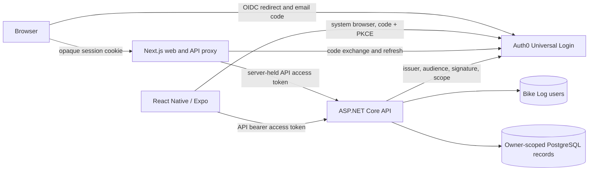

# Bike Log authentication and per-user ownership

Date: 2026-10-08
Status: Revised for Auth0; pending owner review. The earlier Entra design failed its live onboarding gate.

## Intent and scope

Make the existing ASP.NET Core API and Next.js web app safe for separate personal garages, first for the owner and then for a small invite-only pilot. An invited person signs in with an email one-time code. The API determines ownership from a validated identity, and one person's records never appear in another person's responses or mutations. Complete the working web flow first. The identity and API contract must later work for the required React Native/Expo app, whose full UI is a separate milestone.

The web-first milestone covers Auth0 web configuration, pilot-user provisioning, API authentication and authorization, owner migration, and web sign-in/session integration. After that web flow works, a separate native proof adds the native client registration, generated-client bearer support, and Expo device authentication. Neither phase builds the full React Native app, public signup, shared or household garages, social login, passwords, offline sync, or cloud deployment. The visual source is the static [v2 authentication mock](../../ui-design/versions/v2/README.md); v1 remains the approved garage baseline. The mock is not a working authentication implementation.

Web-first success requires two administrator-created pilot identities, using separate approved inboxes, to sign in from the web, see only their own synthetic data, and be unable to read or change each other's records through direct API calls. The later native proof shows that the same API accepts a correctly scoped token obtained on an Expo device. No real personal records or general remote access are permitted until both phases and the ordinary release gates pass; the isolated device proof uses a protected TLS endpoint and synthetic data.

## Identity decision

Use **Auth0** as the OIDC provider, with its established email passwordless connection and Universal Login. Configure the connection for one-time email **codes** and disable public signups. Register a confidential web application and a custom Bike Log API with a `BikeLog.Access` permission for the web milestone; add a separate native public application for the later native proof. Both clients request access tokens for the Bike Log API audience and permission. ID tokens and tokens for other audiences cannot authorize Bike Log API requests. Auth0 owns code generation, email delivery, code expiry, and account authentication. Bike Log never receives or stores codes or passwords.

The Entra pilot was stopped because an administrator-created customer reached a password prompt despite the email-code flow and signup-off setting; see the [sanitized proof](../../auth/identity-proof-results.md). Auth0's documented passwordless user creation, hosted code login, API audience, and API permissions make it the closest replacement for this architecture. Documentation does not prove the required combination, so the Auth0 live gate below precedes production implementation. The newer Auth0 database-connection OTP feature is outside this pilot because its availability is uncertain. Auth0 currently lists passwordless authentication in its free tier; verify current limits and email-delivery requirements before creating a proof tenant. No paid plan, custom domain, or production email service is accepted by this design.

### Invite-only onboarding gate

Public account creation is closed for the pilot. The operator creates each customer identity in Auth0's email passwordless connection and provisions that identity in Bike Log through a restricted local/operator command; there is no public signup or invitation API. The connection's signup option must be disabled and only the intended connection enabled for the pilot applications. Configure Universal Login for the passwordless connection, using an explicit `connection=email` authorization parameter if the hosted flow requires it. A provider account alone never grants Bike Log access.

Before implementing the web flow, prove in a disposable Auth0 tenant that **both** administrator-created customers can complete first-time email-code sign-in with public signup disabled through a web browser redirect. Check that an uncreated address cannot create an account, whether user creation sends an unexpected verification or welcome email, and whether the resulting access token has the Bike Log API audience and `BikeLog.Access` permission. Use the established passwordless connection, not the newer database-connection OTP feature. Record sanitized settings and results; do not store codes, tokens, addresses, or secrets in Git. Before native API integration, repeat the signup-off, code, and API-token proof on an Expo development-build system-browser redirect. If either phase fails, stop that phase and revise the onboarding design with the owner; do not open public signup or substitute password sign-in.

Provisioning resolves the exact Auth0 issuer and user `sub` from trusted administrative data, stores their pair as the immutable external identity key, and assigns a new internal `OwnerId` UUID. The operator confirms the intended person's email before provisioning; email and display name are mutable profile snapshots, never ownership keys. Duplicate external keys or reuse of an existing internal owner are rejected. A disabled Bike Log user cannot access records even while an Auth0 session or token remains valid. Pilot revocation disables the local user immediately and blocks the Auth0 account operationally; deletion/export of real accounts belongs to the later account-lifecycle milestone.

## Architecture and trust boundaries

The API trusts only a validated Auth0 access token and an active local Bike Log user. Configure one exact issuer, the Bike Log API audience, signature validation through provider metadata, token lifetime, and the `BikeLog.Access` permission in the token scope claim. Resolve `(issuer, sub)` to the internal owner UUID on each request. Do not derive ownership from email, display name, URL parameters, request bodies, client headers, or an ID token. Missing/invalid tokens fail before route handlers run. No implicit user creation occurs from a valid provider token.

In authenticated mode, an API-scoped current-owner service replaces `IDevelopmentOwner`. Every protected endpoint uses that owner value for queries and writes. The existing `OwnerId` columns, owner-filtered queries, composite relationships, and per-owner mutation lock remain the foundation. Audit all collection/detail routes, nested bike/component references, replacement and installation paths, reminders, usage projections, rebuilds, stale-version responses, and pagination for owner isolation. A foreign-owner ID is indistinguishable from an absent ID to the caller; no conflict payload reveals its version or contents. The client cannot select an owner.

Authentication mode and existing synthetic mode are explicit and mutually exclusive. Authenticated mode refuses startup when issuer, audience, or other required settings are missing. Synthetic mode retains its current Development, loopback, local-PostgreSQL, and `LocalSyntheticMode=true` restrictions and fixed owner; it cannot be enabled remotely or used with real records. Health and OpenAPI exposure must be reviewed separately from the protected `/api` routes; neither may become a path to user data. API responses and logs must not contain access/refresh tokens, email codes, or raw provider errors.

## Web and native session flow

The web app starts an OIDC authorization-code flow using state, nonce, and PKCE. The callback completes the code exchange server-side and creates an opaque web session. A Secure, HttpOnly, SameSite cookie contains only the session identifier; the server keeps provider tokens encrypted in session storage with expiry and rotation handling. The browser never receives API or refresh tokens in JavaScript storage. Server-side logout ends the Bike Log session and invokes provider logout where supported. Expired, revoked, or disabled sessions return the user to sign-in and clear cached garage data; a safe local return path may restore navigation after sign-in.

The existing Next.js `/api/[...path]` proxy keeps its route allowlist, method checks, no-store responses, and same-origin mutation protection. It now requires a web session, obtains a valid API access token server-side, and forwards it upstream as `Authorization: Bearer`. It never trusts a browser-supplied bearer header as the current user. The web API client continues using the same-origin proxy. Cookie-backed mutations retain CSRF protection, including origin validation; the login callback validates state and redirect URI.

After the web milestone, React Native uses the platform system browser for Auth0 authorization code with PKCE, a registered app redirect, and a public native client ID. It stores refresh credentials only in platform secure storage, attaches short-lived API bearer tokens to calls, and clears credentials and cached garage data on sign-out or loss of access. It does not use the web cookie or a client secret. The shared generated API client then gains a caller-supplied token mechanism without embedding provider logic or owner IDs. Full native screens remain a later milestone; an isolated Expo development build must prove sign-in and one protected API read on a selected device/platform before this design is called native-compatible. A real device reaches only an authenticated TLS API endpoint with synthetic test data during that proof.

## Web experience and errors

Preserve v2's sage/forest visual language, illustration, compact mobile layout, account menu, sign-out, expiration, and retry states where practical. The web app may show a branded entry screen; Auth0 Universal Login collects email and one-time code. Adapt the copy to this flow. Remove the mock's Create account, Verify email, Forgot password, password visibility, and password-policy interactions for the invite-only code pilot. Do not reproduce provider credential fields inside Bike Log unless a later design explicitly selects and validates an embedded provider flow. Branding can approximate v2 but provider page layout remains provider-controlled.

Use product-language messages with a cause and recovery step. Missing/invalid API credentials yield 401; a valid Auth0 identity without an active Bike Log pilot user yields 403; absent or foreign-owner resources yield 404. A provider or API outage offers retry without exposing token or browser diagnostics. Session expiry sends the user to sign-in. Keep unsent form input visible where feasible, but never replay a mutation automatically after authentication because the outcome may be uncertain. Clear user-specific query caches when identity changes or sign-out completes.

## Data migration and operations

Add a Bike Log user table with an internal UUID owner ID, unique external `(issuer, sub)` pair, approval state, and minimal profile snapshot. Use an additive migration for the table and authentication-related session storage. Existing domain tables retain their owner UUIDs and composite keys. Do not reassociate the fixed synthetic owner with a real identity.

The user chose to discard current local synthetic records. Provide a separate, explicit operator command that first verifies synthetic mode, the fixed owner ID, and the target local database, then deletes **only** that owner's application rows in a transaction in dependency-safe order. It requires an affirmative destructive flag, reports counts, and does not run at API startup or during a generic migration. Validate it against a copied database first. Preserve schema, migration history, unrelated owners, and the named PostgreSQL volume. Real accounts start with empty garages.

Operator documentation covers Auth0 tenant, application, connection, and custom API configuration; redirect URIs, audience and permission, signup-off verification, first-user provisioning, disable/re-enable, key/session rotation, and recovery from provider outage. Configuration contains identifiers and metadata URLs; client secrets and session protection keys remain out of source. The native public client has no secret. Deployment, billing acceptance, backups of real data, and production monitoring have their own later gate.

## Verification and acceptance

1. Before API/web implementation, run the invite-only Auth0 web email-code proof for both approved customers with signup off; deny an uncreated address, inspect account-creation email behavior, and verify the web token audience/scope. After the API exists, verify denial of an admin-created Auth0 identity that was not provisioned in Bike Log. Before native integration, repeat signup-off and token-scope verification through an Expo redirect.
2. Unit/integration tests cover token validation failure, missing scope, wrong issuer/audience, user lookup, disabled status, and owner resolution. Exercise every API resource type with two owners, including guessed IDs in nested references, collections, replacement, historical edits, reminders, usage reads/rebuilds, and conflict responses. Confirm 404 rather than data leakage.
3. Web tests cover login callback state/PKCE handling, secure cookie settings, proxy bearer forwarding, rejected browser authorization headers, same-origin/CSRF rules, session expiry, sign-out/cache clearing, and safe retry of edits. Check the v2-derived entry, account, expired, and error layouts at desktop and narrow mobile widths.
4. Integration tests migrate a copy of the existing local database, run the explicit synthetic-owner purge, and verify all other-owner rows, schema, and migration history remain. Repeat the command safely and confirm it never runs at startup.
5. After the web flow is working, the Expo device proof acquires a token for the API, reads a protected empty garage, and verifies denial after the Bike Log user is disabled. No full mobile UI is required. Keep synthetic data in all probes.

The web-first milestone is complete when invite-only web sign-in works, cross-user tests pass for the full API surface, web session controls pass, and the synthetic purge is verified. Native work starts afterward. Real-data consideration still requires the native token contract proof and ordinary release gates. Local tests alone do not establish hosted deployment, backup recovery, or mobile app completion.

## Sources and prior design

- [Current roadmap](../../../PROJECT_PLAN.md) and [overall approved design](2026-10-01-bike-maintenance-design.md)
- [V2 authentication mock and its limits](../../ui-design/versions/v2/README.md)
- [Auth0 user management](https://auth0.com/docs/manage-users/user-accounts/manage-users-using-the-management-api), [email passwordless login](https://developer.auth0.com/resources/labs/authentication/passwordless-with-email), [Universal Login](https://auth0.com/docs/authenticate/login/auth0-universal-login), [passwordless connection selection](https://support.auth0.com/center/s/article/Passwordless-login-not-triggered-using-the-New-Universal-Login-with-Identifier-First-Profile), and [signup-off behavior](https://support.auth0.com/center/s/article/How-to-restrict-email-domains-from-registering-to-the-Passwordless-email-connection)
- [Auth0 API access tokens](https://auth0.com/docs/secure/tokens/access-tokens/get-access-tokens), [Expo protected API guide](https://developer.auth0.com/resources/guides/mobile/react-native/expo-authentication), and [Expo authentication](https://docs.expo.dev/guides/authentication/)
- [Auth0 pricing](https://auth0.com/pricing) and [passwordless user-creation email behavior](https://support.auth0.com/center/s/article/verify-email-false-for-passwordless-connection-still-sending-verification-email)
