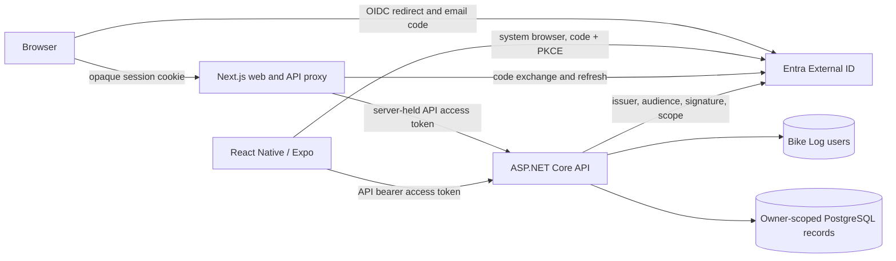

# Bike Log authentication and per-user ownership

Date: 2026-10-08
Status: Design approved in conversation; written specification awaiting owner review.

## Intent and scope

Make the existing ASP.NET Core API and Next.js web app safe for separate personal garages, first for the owner and then for a small invite-only pilot. An invited person signs in with an email one-time code. The API determines ownership from a validated identity, and one person's records never appear in another person's responses or mutations. The identity and API contract must also work for the required React Native/Expo app, whose full UI is a later milestone.

This milestone covers Entra configuration, pilot-user provisioning, API authentication and authorization, owner migration, web sign-in/session integration, generated-client authentication support, and an Expo device authentication proof. It does not build the full React Native app, public signup, shared or household garages, social login, passwords, offline sync, or cloud deployment. The visual source is the static [v2 authentication mock](../../ui-design/versions/v2/README.md); v1 remains the approved garage baseline. The mock is not a working authentication implementation.

Success requires two invited test people to sign in from the web, see only their own data, and be unable to read or change each other's records through direct API calls. The same API accepts a correctly scoped token obtained by a small Expo device proof. No real personal records or general remote access are permitted until these checks and the ordinary release gates pass; the isolated device proof uses a protected TLS endpoint and synthetic data.

## Identity decision

Use **Microsoft Entra External ID in an external tenant** as the OIDC provider. Configure a customer user flow for email one-time passcode and browser-delegated authentication. Use separate web and native client registrations and one Bike Log API registration with a delegated access scope. Both clients request access tokens intended for that API; ID tokens and tokens for other audiences cannot authorize Bike Log API requests. Entra owns code generation, email delivery, code expiry, and account authentication. Bike Log never receives or stores codes or passwords.

Entra fits the project's Azure learning goal and documents email-code sign-in, hosted-page branding, authorization code with PKCE, native clients, and ASP.NET API protection. Auth0 is a viable managed alternative with email-code login and more page customization, but introduces another identity platform. Implementing Bike Log's own code issuer would add delivery, rate limiting, abuse handling, session, and recovery responsibilities without serving this milestone. Entra's core tier currently includes 50,000 free monthly active users; optional premium features and the rest of the application infrastructure have separate costs. Verify current pricing and subscription settings before provisioning.

### Invite-only onboarding gate

Public account creation is closed for the pilot. The operator creates each customer identity in Entra and provisions that identity in Bike Log through a restricted local/operator command; there is no public signup or invitation API. Entra's signup option must be disabled. A provider account alone never grants Bike Log access.

Before implementing the production flow, prove in a disposable external tenant that an administrator-created customer can complete first-time **email one-time code** sign-in with public signup disabled, on both web and Expo browser redirects. Microsoft's separate documentation for these features does not establish their combination. Record the observed tenant settings and result. If the combination fails, stop and revise this onboarding design with the owner; do not silently open public signup or substitute password sign-in.

Provisioning resolves the Entra tenant ID and user object ID from trusted administrative data, stores their pair as the immutable external identity key, and assigns a new internal `OwnerId` UUID. The operator confirms the intended person's email before provisioning; email and display name are mutable profile snapshots, never ownership keys. Duplicate external keys or reuse of an existing internal owner are rejected. A disabled Bike Log user cannot access records even while an Entra session or token remains valid. Pilot revocation disables the local user immediately and disables the Entra account operationally; deletion/export of real accounts belongs to the later account-lifecycle milestone.

## Architecture and trust boundaries

The API trusts only a validated Entra access token and an active local Bike Log user. Configure one allowed external tenant/issuer, the API audience, signature validation through provider metadata, token lifetime, and the delegated API scope. Resolve `(tenant ID, user object ID)` to the internal owner UUID on each request. Do not derive ownership from email, display name, URL parameters, request bodies, client headers, or an ID token. Missing/invalid tokens fail before route handlers run. No implicit user creation occurs from a valid provider token.

In authenticated mode, an API-scoped current-owner service replaces `IDevelopmentOwner`. Every protected endpoint uses that owner value for queries and writes. The existing `OwnerId` columns, owner-filtered queries, composite relationships, and per-owner mutation lock remain the foundation. Audit all collection/detail routes, nested bike/component references, replacement and installation paths, reminders, usage projections, rebuilds, stale-version responses, and pagination for owner isolation. A foreign-owner ID is indistinguishable from an absent ID to the caller; no conflict payload reveals its version or contents. The client cannot select an owner.

Authentication mode and existing synthetic mode are explicit and mutually exclusive. Authenticated mode refuses startup when issuer, audience, or other required settings are missing. Synthetic mode retains its current Development, loopback, local-PostgreSQL, and `LocalSyntheticMode=true` restrictions and fixed owner; it cannot be enabled remotely or used with real records. Health and OpenAPI exposure must be reviewed separately from the protected `/api` routes; neither may become a path to user data. API responses and logs must not contain access/refresh tokens, email codes, or raw provider errors.

## Web and native session flow

The web app starts an OIDC authorization-code flow using state, nonce, and PKCE. The callback completes the code exchange server-side and creates an opaque web session. A Secure, HttpOnly, SameSite cookie contains only the session identifier; the server keeps provider tokens encrypted in session storage with expiry and rotation handling. The browser never receives API or refresh tokens in JavaScript storage. Server-side logout ends the Bike Log session and invokes provider logout where supported. Expired, revoked, or disabled sessions return the user to sign-in and clear cached garage data; a safe local return path may restore navigation after sign-in.

The existing Next.js `/api/[...path]` proxy keeps its route allowlist, method checks, no-store responses, and same-origin mutation protection. It now requires a web session, obtains a valid API access token server-side, and forwards it upstream as `Authorization: Bearer`. It never trusts a browser-supplied bearer header as the current user. The web API client continues using the same-origin proxy. Cookie-backed mutations retain CSRF protection, including origin validation; the login callback validates state and redirect URI.

React Native uses the platform system browser for Entra authorization code with PKCE, a registered app redirect, and a public native client ID. It stores refresh credentials only in platform secure storage, attaches short-lived API bearer tokens to calls, and clears credentials and cached garage data on sign-out or loss of access. It does not use the web cookie or a client secret. The shared generated API client accepts a caller-supplied token mechanism without embedding provider logic or owner IDs. Full native screens remain a later milestone; an isolated Expo development build must prove sign-in and one protected API read on a selected device/platform before this design is called native-compatible. A real device reaches only an authenticated TLS API endpoint with synthetic test data during that proof.

## Web experience and errors

Preserve v2's sage/forest visual language, illustration, compact mobile layout, account menu, sign-out, expiration, and retry states where practical. The web app may show a branded entry screen; Entra-hosted pages collect email and one-time code. Adapt the copy to this flow. Remove the mock's Create account, Verify email, Forgot password, password visibility, and password-policy interactions for the invite-only code pilot. Do not reproduce provider credential fields inside Bike Log unless a later design explicitly selects and validates an embedded provider flow. Branding can approximate v2 but provider page layout remains provider-controlled.

Use product-language messages with a cause and recovery step. Missing/invalid API credentials yield 401; a valid Entra identity without an active Bike Log pilot user yields 403; absent or foreign-owner resources yield 404. A provider or API outage offers retry without exposing token or browser diagnostics. Session expiry sends the user to sign-in. Keep unsent form input visible where feasible, but never replay a mutation automatically after authentication because the outcome may be uncertain. Clear user-specific query caches when identity changes or sign-out completes.

## Data migration and operations

Add a Bike Log user table with an internal UUID owner ID, unique external `(tenant ID, object ID)` pair, approval state, and minimal profile snapshot. Use an additive migration for the table and authentication-related session storage. Existing domain tables retain their owner UUIDs and composite keys. Do not reassociate the fixed synthetic owner with a real identity.

The user chose to discard current local synthetic records. Provide a separate, explicit operator command that first verifies synthetic mode, the fixed owner ID, and the target local database, then deletes **only** that owner's application rows in a transaction in dependency-safe order. It requires an affirmative destructive flag, reports counts, and does not run at API startup or during a generic migration. Validate it against a copied database first. Preserve schema, migration history, unrelated owners, and the named PostgreSQL volume. Real accounts start with empty garages.

Operator documentation covers tenant/client/API registrations, redirect URIs, delegated scope, signup-off verification, first-user provisioning, disable/re-enable, key/session rotation, and recovery from provider outage. Configuration contains identifiers and metadata URLs; client secrets and session protection keys remain out of source. The native public client has no secret. Deployment, billing acceptance, backups of real data, and production monitoring have their own later gate.

## Verification and acceptance

1. Run the invite-only email-code onboarding proof described above before committing to an implementation path. Verify both web and Expo redirects, signup-off behavior, token audience/scope, and denial of an admin-created Entra identity that was not provisioned in Bike Log.
2. Unit/integration tests cover token validation failure, missing scope, wrong issuer/audience, user lookup, disabled status, and owner resolution. Exercise every API resource type with two owners, including guessed IDs in nested references, collections, replacement, historical edits, reminders, usage reads/rebuilds, and conflict responses. Confirm 404 rather than data leakage.
3. Web tests cover login callback state/PKCE handling, secure cookie settings, proxy bearer forwarding, rejected browser authorization headers, same-origin/CSRF rules, session expiry, sign-out/cache clearing, and safe retry of edits. Check the v2-derived entry, account, expired, and error layouts at desktop and narrow mobile widths.
4. Integration tests migrate a copy of the existing local database, run the explicit synthetic-owner purge, and verify all other-owner rows, schema, and migration history remain. Repeat the command safely and confirm it never runs at startup.
5. The Expo device proof acquires a token for the API, reads a protected empty garage, and verifies denial after the Bike Log user is disabled. No full mobile UI is required. Keep synthetic data in all probes.

The milestone is ready for real-data consideration only when the invite-only flow works, cross-user tests pass for the full API surface, web session controls pass, the synthetic purge is verified, and the native token contract is proven. Local tests alone do not establish hosted deployment, backup recovery, or mobile app completion.

## Sources and prior design

- [Current roadmap](../../../PROJECT_PLAN.md) and [overall approved design](2026-10-01-bike-maintenance-design.md)
- [V2 authentication mock and its limits](../../ui-design/versions/v2/README.md)
- [Entra External ID customer sign-in methods](https://learn.microsoft.com/en-us/entra/external-id/customers/concept-authentication-methods-customers), [disable signup](https://learn.microsoft.com/en-us/entra/external-id/customers/how-to-disable-sign-up-user-flow), [manage customer accounts](https://learn.microsoft.com/en-us/entra/external-id/customers/how-to-manage-customer-accounts), and [branding](https://learn.microsoft.com/en-us/entra/external-id/customers/how-to-customize-branding-customers)
- [Microsoft access-token claim validation](https://learn.microsoft.com/en-us/entra/identity-platform/claims-validation) and [Expo authentication](https://docs.expo.dev/guides/authentication/)
- [Entra External ID pricing](https://azure.microsoft.com/en-us/pricing/details/microsoft-entra-external-id/) and [billing details](https://learn.microsoft.com/en-us/entra/external-id/external-identities-pricing)
